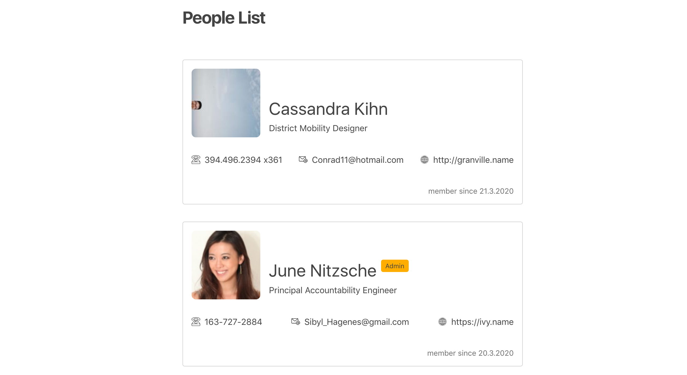

# List with JSX

Let's refactor with components! UI should remain visually the same:

* use [create-react-app](https://create-react-app.dev/docs/getting-started) to boostrap a project
* use JSX to display the list

* the list of items will become a component: `List`
* each list item will be a component as well: `ListItem`
* the social links will be a component: `SocialLinksList`
* each link item will be a component as well: `SocialLinkItem`
* make sure you make gradual changes and commit each of them
